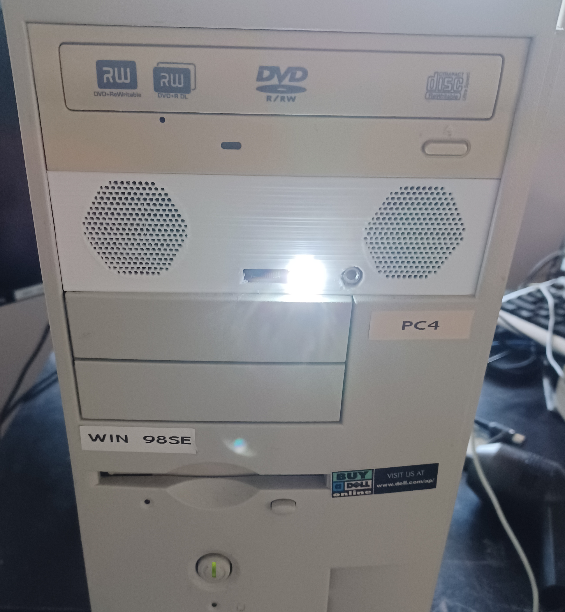
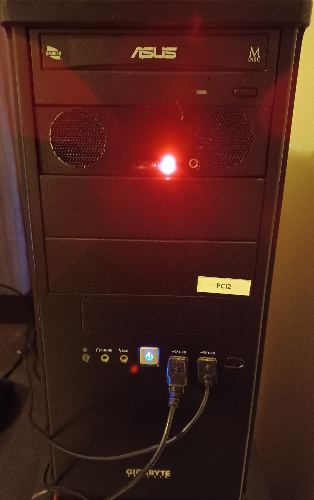
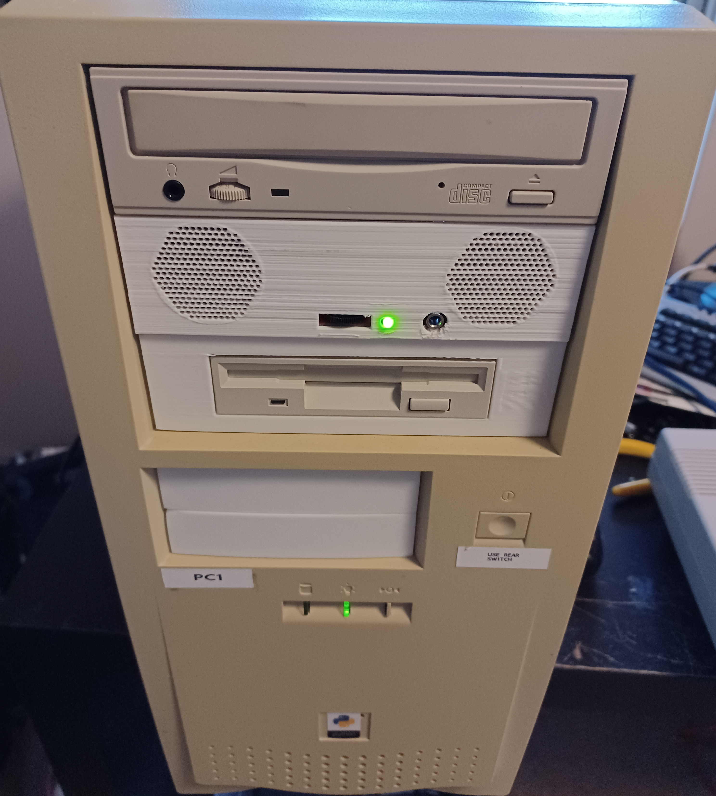
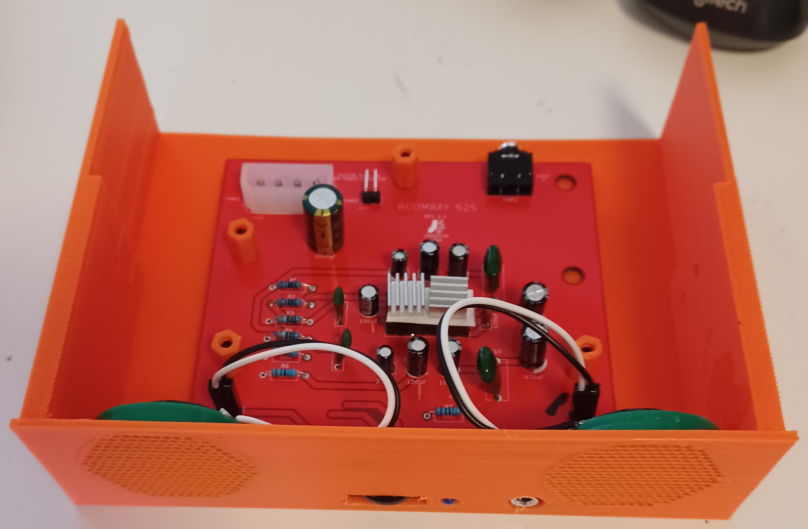
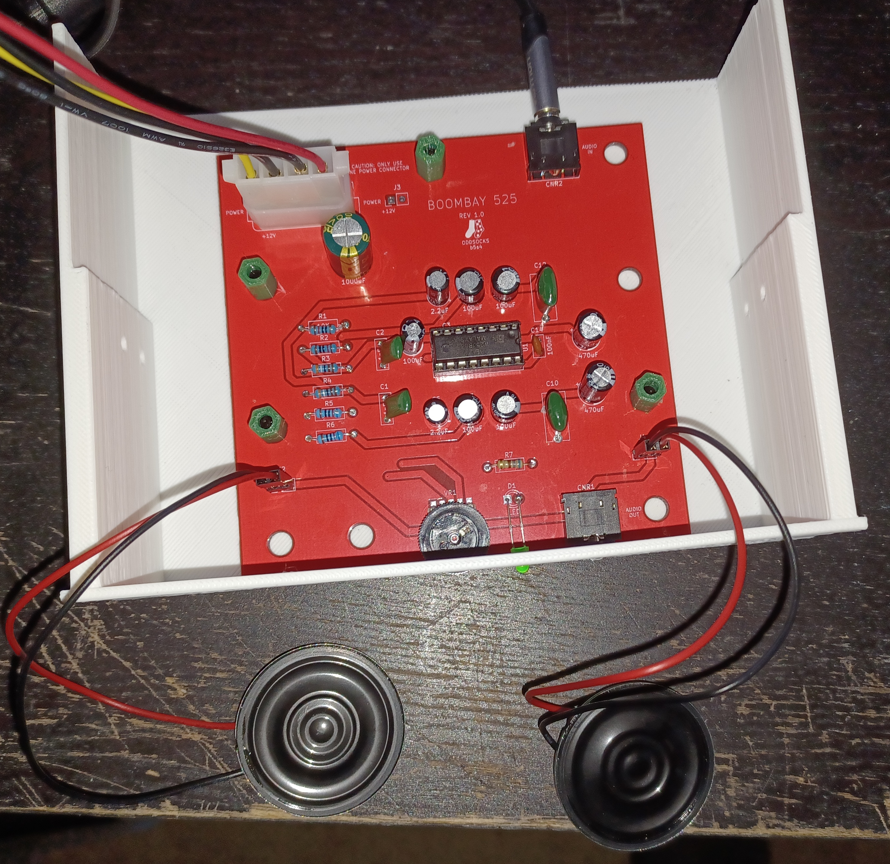
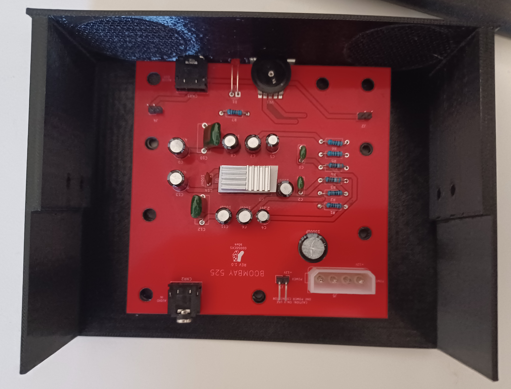
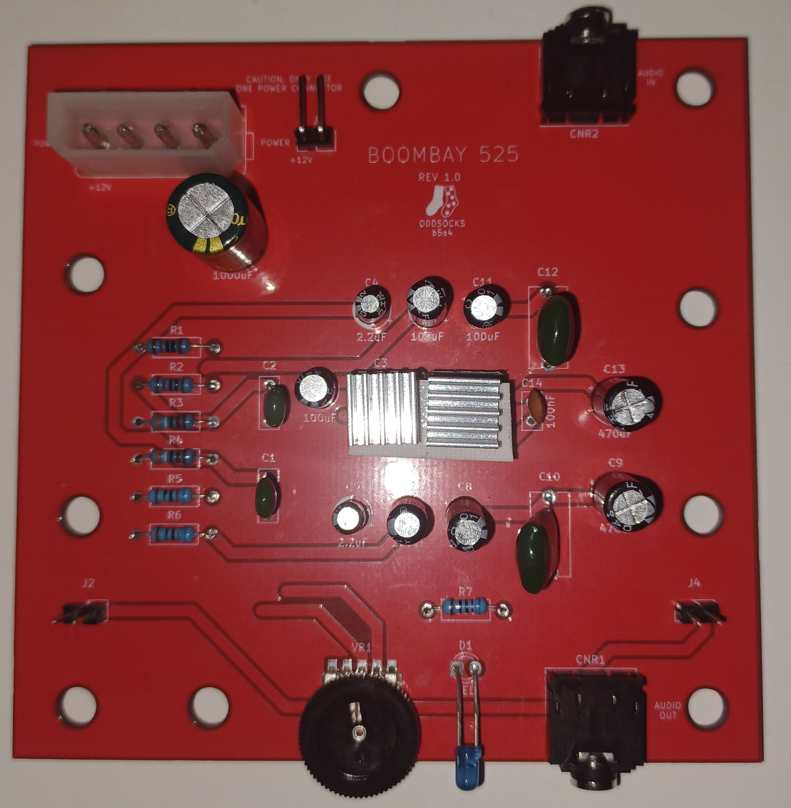

# BoomBay 525

## Description
A stereo speaker and amplifier for mounting in a 5.25" computer drive bay. Intended for retro-computers but could easily be used in a modern computer.

**Features**
* 3D printable 5.25" mounting case
* 2 x 36mm speakers
* Powered by a standard "hard drive" style molex connector
* Connects to your sound card's audio out
* Front volume control
* Front headphone jack socket
* Power LED

## Bill of Materials

Please also read the BOM notes.

| Qty | Component                                                           |
|:---:|---------------------------------------------------------------------|
| 2   | 1nF Mylar/Film Capacitors                                           |
| 2   | 150nF Mylar/Film Capacitors                                         | 
| 5   | 100uF Electrolytic Capacitors                                       |
| 2   | 2.2uF Electrolytic Capacitors                                       |
| 2   | 470uF Electrolytic Capacitors                                       |
| 1   | 1000uF Electrolytic Capacitor                                       |
| 1   | 100nf Ceramic Capacitor                                             |
| 2   | 10KΩ Axial Resistors                                                |
| 2   | 3.9KΩ Axial Resistors                                               |
| 2   | 620Ω Axial Resistors                                                |
| 1   | 680Ω Axial Resistor                                                 |
| 1   | 3mm LED                                                             |
| 2   | 5-pin 3.5mm Audio Jack Sockets TN/T/RN/R/S                          |
| 1   | Male "Molex" connector (see BOM notes)                              |
| 1   | 5-pin 10KΩ 16mm Thumbwheel Rotary Gear Potentiometer (see BOM notes)|
| 1   | TEA2025B 16pin DIP (or compatible)                                  |
| 2   | 36mm 8Ω Speakers (range 0.25 to 1 watt)                             |
| 3   | 2pin Headers (2.54mm Pitch) (see BOM notes)                         |
| 1   | 1 x Audio Cable with 3.5mm jacks at each end                        |

## BOM Notes

 * "Molex" Connector
   * The colloquilly named Molex connector is used for power. This connector is known by many names (eg MATE-N-LOK 350211), but is essentially the same power connector that was used on older hard disks and CD/DVD drives etc.
   * The right-angled version of the Molex connector would be preferred, but straight versions are perfectly usable and easier to obtain.
   * The Molex connector is not required, **if you intend to power the device by the alternate dupont connector instead.**
 * The Thumbwheel
   * This is used for volume control and these components were common on many audio devices.
   * It goes by various names, but ensure you get the 5pin variant with 16mm diameter gear.
 * 2pin Headers
   * The connector at J3 is intended for connecting a power source using a dupont connector. It is not required, **if you intend to power the device by the molex connector instead.**
   * The connectors at J2 and J4 are intended for connecting the speakers via dupont connectors. They are not required if you intend to solder the speaker wires directly to the PCB.
 * IC sockets optional.
 

## PCB Assembly Notes

 * The thumbwheel should be mounted on the top-side of the PCB
 * The LED should be bent over and mounted so that the 'bulb' hangs just over the PCB. See the images for more context.
 * Although the connection polarity of the speakers doesn't matter electrically, it does matter **acoustically**. Ensure both speakers use the same connection order for their wires. 
 

## 3D Printable Case
The STL files for the case are included in the repo. The PCB is designed to be mounted into this case, which can than be inserted into the 5.25" drive bay of a computer

 * Print the case in it's normal orientation.
 * Print supports are needed for the volume, LED and headphone cut-outs on the front, but **not** for the speaker grille or side mounting screw holes.
 * Print 4 x Screw Nuts.

 
## Case Assembly
Please see the images in addition to these instructions.

 * Cleanly remove the printing supports from the volume, LED and headphone cut-outs on the front of the case.
 * Insert the PCB into the case, ensuring the volume control, LED and headphone socket cleanly protrude through the cut-outs.
 * Match the 4 x PCB mounting holes with the holes in the PCB. With a good quality print, they should generally 'click' into place with a bit of a wiggle.
 * You will need 4 x 3.5mm self-tapping screws. Max length about 15mm.
 * From the base, insert a screw throught the case still it starts to protude through the PCB.
 * Hold one of the 3D printed nuts over the screw with a pair of pliers. This is to prevent the nut from spinning when turning the screw.
 * Turn the screw so that it tightens, starts to screw into the nut and then holds the PCB.
 * Repeat for the remaining 3 screws,

 
## Mounting in a Computer
 * Find an empty 5.25" drive
 * Insert the BoomBay 525 into the drive pay
 * Connect the Power
 * Connect the 3.5mm audio jack cable to the audio-in on the BoomBay 5.25
 * Route the other end of the cable through a convenient hole in the rear of the case. This could be:
   * An purposely designed case feature
   * A whole for a socket not used
   * A while rear a blanking-plate has been removed
   * Use a blanking plate with an appropriately size hole etc.
 * Plug the other end into the sound card audio-out
 
 
## Support Me
* [My Projects](https://projects.amiga-hardware.com) - Donate on this page
* [Order the BoomBay PCB](https://www.pcbway.com/project/shareproject/BoomBay_525_Speakers_in_your_5_25_Drive_Bay_84e0584a.html)
* [Order the BoomBay Case](https://www.pcbway.com/project/shareproject/BoomBay_525_Case_Speakers_in_your_5_25_Drive_Bay_3b4b11f0.html)
